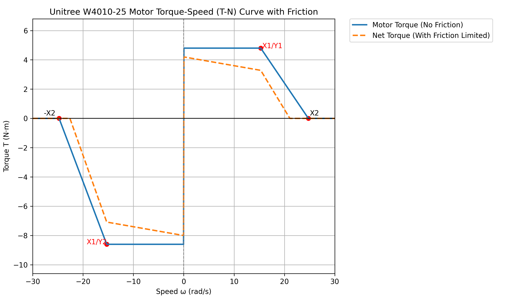

<div align="center">
  <h1 align="center">Dex1_1 service</h1>
  <a href="https://www.unitree.com/" target="_blank">
    
  </a>
</div>

# 0. 📖 Introduction

This is a serial2dds service for the Dex1_1 gripper.

The Dex1_1 is a parallel two-finger gripper developed by Unitree. It uses a single unitree M4010 motor to drive the gripper.

<p align="center">
  <a href="https://oss-global-cdn.unitree.com/static/3077509a2c6e4a9ebe1e57d45a42d1af_1796x1420.png">
    
  </a>
</p>


# 1. 📦 Installation

```bash
# at user development computing unit PC2 (NVIDIA Jetson Orin NX board)
sudo apt install libspdlog-dev libboost-all-dev libyaml-cpp-dev libfmt-dev
cd ~
git clone https://github.com/unitreerobotics/dex1_1_service
cd dex1_1_service
mkdir build && cd build
cmake ..
make -j6
```

# 2. 🚀 Launch

```bash
# Run `sudo ./dex1_1_gripper_server -h` for details. The output will be:
# Unitree Dex1-1 Gripper Server:
#   -h [ --help ]                produce help message
#   -v [ --version ]             show version
#   -n [ --network ] arg (=eth0) dds networkInterface
#   -c [ --calibration ]         calibrate the gripper motor

# start server
sudo ./dex1_1_gripper_server --network eth0
# Simplified (defaults apply)
sudo ./dex1_1_gripper_server

# Run `sudo ./test_dex1_1_gripper_server -h` for details. The output will be:
# Unitree Dex1-1 Gripper Server Test:
#   -h [ --help ]                produce help message
#   -v [ --version ]             show version
#   -n [ --network ] arg (=eth0) dds networkInterface
#   -l [ --left ]                test left dex1 gripper
#   -r [ --right ]               test right dex1 gripper

# run test examples
sudo ./test_dex1_1_gripper_server --network eth0 -l -r
# Test only the left side or the right side individually.
sudo ./test_dex1_1_gripper_server --network eth0 -l
# or test only the right side or the right side individually.
sudo ./test_dex1_1_gripper_server -r
```

# 3. 📏 Calibration

Close the gripper and run the following command to calibrate the gripper.

```bash
sudo ./dex1_1_gripper_server -c
```

------

Here is an example output from a calibration process.

```bash
unitree@ubuntu:~/dex1_1_service/build$ sudo ./dex1_1_gripper_server -c
[2025-01-01 00:00:26.514] [info] Available Serial Ports: /dev/ttyUSB3, /dev/ttyUSB2, /dev/ttyUSB1, /dev/ttyUSB0
[2025-01-01 00:00:26.669] [info] Detected motors:
[2025-01-01 00:00:26.669] [info]   - Motor ID: 0         Side: Right     Port: /dev/ttyUSB2      cmdTopic: rt/dex1/Right/cmd     stateTopic: rt/dex1/Right/state
[2025-01-01 00:00:26.669] [info]   - Motor ID: 1         Side: Left      Port: /dev/ttyUSB1      cmdTopic: rt/dex1/Left/cmd      stateTopic: rt/dex1/Left/state
[2025-01-01 00:00:26.669] [info] ========== Motor Calibration (Motor 1 (index) of 2 (total)) ==========
[2025-01-01 00:00:26.669] [info]   - Motor ID: 0,        Side: Right,    Port: /dev/ttyUSB2
[2025-01-01 00:00:26.669] [info] Please manually close the gripper tightly. 
                                 Then press 's' + Enter to calibrate, or any other key to skip.
>
```

You need to manually close the gripper tightly, just like shown in the picture.

<p align="center">
  <a href="https://oss-global-cdn.unitree.com/static/34d3cbce3ab9404cb6c477a43004b269_1717x1407.png">
    
  </a>
</p>

After closing it, press the **s** key and then **Enter**.

```bash
> s
[2025-01-01 00:00:28.024] [info] Calibrating motor 0...
Motor type: MotorType::M4010
Id: 0
Calibration successful!
[2025-01-01 00:00:28.042] [info] Motor 0 calibration successful.
[2025-01-01 00:00:28.042] [info] ========== Motor Calibration (Motor 2 (index) of 2 (total)) ==========
[2025-01-01 00:00:28.042] [info]   - Motor ID: 1,        Side: Left,     Port: /dev/ttyUSB1
[2025-01-01 00:00:28.042] [info] Please manually close the gripper tightly. 
                                 Then press 's' + Enter to calibrate, or any other key to skip.
>
```

Same as the previous step, continue calibrating the second one.

```bash
> s
[2025-01-01 00:00:28.881] [info] Calibrating motor 1...
Motor type: MotorType::M4010
Id: 1
Calibration successful!
[2025-01-01 00:00:28.903] [info] Motor 1 calibration successful.
[2025-01-01 00:00:28.903] [info] Calibration process completed.
```


Check results.

```bash
unitree@ubuntu:~/dex1_1_service/build$ sudo ./test_dex1_1_gripper_server -l -r
# The gripper’s initial position should be near zero.
[2025-01-01 00:00:13.776] [info] Right gripper init at q = 0.001
[2025-01-01 00:00:14.978] [info] Left gripper init at q = 0.000
R= 0.508 L= 0.502
```


# 4. 🎨 Actuator Parameters

<p align="center">
  <a href="https://github.com/unitreerobotics/unitree_rl_lab/blob/main/source/unitree_rl_lab/unitree_rl_lab/assets/robots/unitree_actuators.py">
    
  </a>
</p>

```python
class UnitreeActuator(DelayedPDActuator):
    """Unitree actuator class that implements a torque-speed curve for the actuators.

    The torque-speed curve is defined as follows:

            Torque Limit, N·m
                ^
    Y2──────────|
                |──────────────Y1
                |              │\
                |              │ \
                |              │  \
                |              |   \
    ------------+--------------|------> velocity: rad/s
                              X1   X2

    - Y1: Peak Torque Test (Torque and Speed in the Same Direction)
    - Y2: Peak Torque Test (Torque and Speed in the Opposite Direction)
    - X1: Maximum Speed at Full Torque (T-N Curve Knee Point)
    - X2: No-Load Speed Test

    - Fs: Static friction coefficient
    - Fd: Dynamic friction coefficient
    - Va: Velocity at which the friction is fully activated
    """

    cfg: UnitreeActuatorCfg

    armature: torch.Tensor
    """The armature of the actuator joints. Shape is (num_envs, num_joints).
        armature = J2 + J1 * i2 ^ 2 + Jr * (i1 * i2) ^ 2
    """
    # ...

@configclass
class UnitreeActuatorCfg(DelayedPDActuatorCfg):
    """
    Configuration for Unitree actuators.
    """

    class_type: type = UnitreeActuator

    X1: float = 1e9
    """Maximum Speed at Full Torque(T-N Curve Knee Point) Unit: rad/s"""

    X2: float = 1e9
    """No-Load Speed Test Unit: rad/s"""

    Y1: float = MISSING
    """Peak Torque Test(Torque and Speed in the Same Direction) Unit: N*m"""

    Y2: float | None = None
    """Peak Torque Test(Torque and Speed in the Opposite Direction) Unit: N*m"""

    Fs: float = 0.0
    """ Static friction coefficient """

    Fd: float = 0.0
    """ Dynamic friction coefficient """

    Va: float = 0.01
    """ Velocity at which the friction is fully activated """

@configclass
class UnitreeActuatorCfg_W4010_25(UnitreeActuatorCfg):
    X1 = 15.3
    X2 = 24.76
    Y1 = 4.8
    Y2 = 8.6

    Fs = 0.6
    Fd = 0.06

    """
    | rotor  | 0.068e-4 kg·m²
    | gear_1 |                | ratio | 5
    | gear_2 |                | ratio | 5
    """
    armature = 0.00425
```


# ❓ FAQ
1. Error when `make -j6`:
    ```bash
    unitree@ubuntu:~/dex1_1_service/build$ make -j6
    Scanning dependencies of target dex1_1_gripper_server
    Scanning dependencies of target test_dex1_1_gripper_server
    [ 50%] Building CXX object CMakeFiles/test_dex1_1_gripper_server.dir/test/test_gripper.cpp.o
    [ 50%] Building CXX object CMakeFiles/dex1_1_gripper_server.dir/main.cpp.o
    /home/unitree/dex1_1_service/test/test_gripper.cpp:1:10: fatal error: unitree/idl/go2/MotorCmds_.hpp: No such file or directory
        1 | #include <unitree/idl/go2/MotorCmds_.hpp>
          |          ^~~~~~~~~~~~~~~~~~~~~~~~~~~~~~~~
    /home/unitree/dex1_1_service/main.cpp:1:10: fatal error: unitree/idl/go2/MotorCmds_.hpp: No such file or directory
        1 | #include <unitree/idl/go2/MotorCmds_.hpp>
          |          ^~~~~~~~~~~~~~~~~~~~~~~~~~~~~~~~
    compilation terminated.
    compilation terminated.
    ```
    This error mentions that the unitree_sdk2 headfile could not be found. First compile and install unitree_sdk2:
    ```bash
    cd ~
    git clone https://github.com/unitreerobotics/unitree_sdk2
    cd unitree_sdk2
    mkdir build & cd build
    cmake ..
    sudo make install
    ```
2. Error when `sudo ./dex1_1_gripper_server`:
    ```bash
    unitree@ubuntu:~/dex1_1_service/build$ sudo ./dex1_1_gripper_server
    [2025-08-14 09:56:53.595] [info] Available Serial Ports: /dev/ttyUSB3, /dev/ttyUSB2, /dev/ttyUSB1, /dev/ttyUSB0
    [2025-08-14 09:56:54.339] [error] Motors not found after multiple attempts.
    # or
    unitree@ubuntu:~/dex1_1_service/build$ sudo ./dex1_1_gripper_server
    [2025-08-14 09:58:12.010] [info] Available Serial Ports: 
    [2025-08-14 09:58:12.010] [warning] No ttyUSB serial ports found.
    ```
    The two situations described above are:  
    1. The gripper power is not connected.  
    2. The gripper serial board (which connects to the G1 USB port) is not connected.
