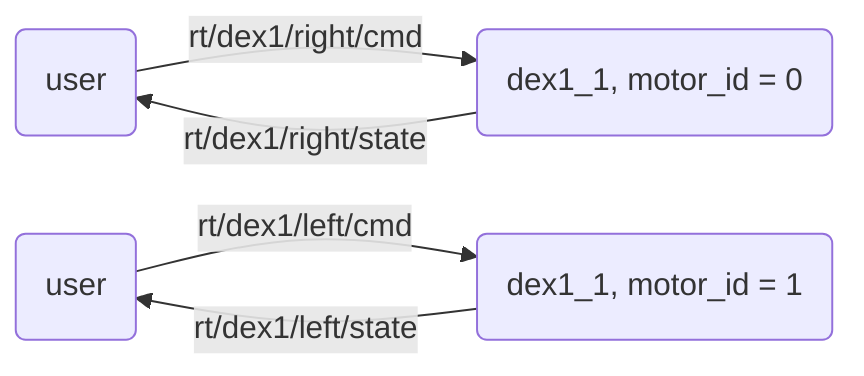

<div align="center">
  <h1 align="center">
    <a href="https://www.unitree.com/cn/Dex1-1" target="_blank">Dex1_1 Service</a>
  </h1>
  <a href="https://www.unitree.com/" target="_blank">
    
  </a>
  <p align="center">
    <a> English </a> | <a href="README_zh-CN.md">中文</a> </a>
  </p>
</div>

# 0. 📖 介绍

这是一个用于 Dex1_1 夹爪的 serial2dds 服务。

Dex1_1 是 Unitree 开发的夹爪，为具⾝智能应⽤⽽⽣。

<p align="center">
  <a href="https://oss-global-cdn.unitree.com/static/3077509a2c6e4a9ebe1e57d45a42d1af_1796x1420.png">
    
  </a>
</p>



# 1. 📦 安装

```bash
# 在用户开发计算单元 PC2（NVIDIA Jetson Orin NX 板）
sudo apt install libspdlog-dev libboost-all-dev libyaml-cpp-dev libfmt-dev
cd ~
git clone https://github.com/unitreerobotics/dex1_1_service
cd dex1_1_service
mkdir build && cd build
cmake ..
make -j6
```

# 2. 🚀 启动

```bash
# 运行 `sudo ./dex1_1_gripper_server -h` 查看帮助详情。输出为：
# Unitree Dex1-1 Gripper Server:
#   -h [ --help ]                produce help message
#   -v [ --version ]             show version
#   -n [ --network ] arg (=eth0) dds networkInterface
#   -c [ --calibration ]         calibrate the gripper motor

# 启动服务器
sudo ./dex1_1_gripper_server --network eth0
# 简化方式（默认参数）
sudo ./dex1_1_gripper_server

# 运行 `sudo ./test_dex1_1_gripper_server -h` 查看帮助详情。输出为：
# Unitree Dex1-1 Gripper Server Test:
#   -h [ --help ]                produce help message
#   -v [ --version ]             show version
#   -n [ --network ] arg (=eth0) dds networkInterface
#   -l [ --left ]                test left dex1 gripper
#   -r [ --right ]               test right dex1 gripper

# 运行测试示例
sudo ./test_dex1_1_gripper_server --network eth0 -l -r
# 仅测试左侧或右侧夹爪
sudo ./test_dex1_1_gripper_server --network eth0 -l
# 或仅测试右侧夹爪
sudo ./test_dex1_1_gripper_server -r
```

# 3. 📏 标定

> 💡 注意：电机 ID 为 0 时，设定为右侧夹爪； ID 为 1 时，设定为左侧夹爪

闭合夹爪并运行以下命令进行电机标定。

```bash
sudo ./dex1_1_gripper_server -c
```

---

以下是标定过程示例输出。

```bash
unitree@ubuntu:~/dex1_1_service/build$ sudo ./dex1_1_gripper_server -c
[2025-01-01 00:00:26.514] [info] Available Serial Ports: /dev/ttyUSB3, /dev/ttyUSB2, /dev/ttyUSB1, /dev/ttyUSB0
[2025-01-01 00:00:26.669] [info] Detected motors:
[2025-01-01 00:00:26.669] [info]   - Motor ID: 0         Side: Right     Port: /dev/ttyUSB2      cmdTopic: rt/dex1/right/cmd     stateTopic: rt/dex1/right/state
[2025-01-01 00:00:26.669] [info]   - Motor ID: 1         Side: Left      Port: /dev/ttyUSB1      cmdTopic: rt/dex1/left/cmd      stateTopic: rt/dex1/left/state
[2025-01-01 00:00:26.669] [info] ========== Motor Calibration (Motor 1 (index) of 2 (total)) ==========
[2025-01-01 00:00:26.669] [info]   - Motor ID: 0,        Side: Right,    Port: /dev/ttyUSB2
[2025-01-01 00:00:26.669] [info] Please manually close the gripper tightly. 
                                 Then press 's' + Enter to calibrate, or any other key to skip.
>
```

你需要像图中一样手动紧闭夹爪。

<p align="center">
  <a href="https://oss-global-cdn.unitree.com/static/34d3cbce3ab9404cb6c477a43004b269_1717x1407.png">
    
  </a>
</p>

紧闭合后，按 **s** 键，然后 **Enter**。

```bash
> s
[2025-01-01 00:00:28.024] [info] Calibrating motor 0...
Motor type: MotorType::M4010
Id: 0
Calibration successful!
[2025-01-01 00:00:28.042] [info] Motor 0 calibration successful.
[2025-01-01 00:00:28.042] [info] ========== Motor Calibration (Motor 2 (index) of 2 (total)) ==========
[2025-01-01 00:00:28.042] [info]   - Motor ID: 1,        Side: Left,     Port: /dev/ttyUSB1
[2025-01-01 00:00:28.042] [info] Please manually close the gripper tightly. 
                                 Then press 's' + Enter to calibrate, or any other key to skip.
>
```

与上一步相同，继续标定第二个夹爪。

```bash
> s
[2025-01-01 00:00:28.881] [info] Calibrating motor 1...
Motor type: MotorType::M4010
Id: 1
Calibration successful!
[2025-01-01 00:00:28.903] [info] Motor 1 calibration successful.
[2025-01-01 00:00:28.903] [info] Calibration process completed.
```

检查结果。

```bash
unitree@ubuntu:~/dex1_1_service/build$ sudo ./test_dex1_1_gripper_server -l -r
# 夹爪初始位置应接近零
[2025-01-01 00:00:13.776] [info] Right gripper init at q = 0.001
[2025-01-01 00:00:14.978] [info] Left gripper init at q = 0.000
R= 0.508 L= 0.502
```


# 4. 🚀🚀🚀 开机自启服务

在完成上述设置和配置，并成功测试 dex1_1_gripper_server 后，你可以通过运行以下脚本，将 dex1_1_gripper_server 配置为系统启动时自动运行：

```bash
bash setup_autostart.sh
```

按照脚本中的提示完成配置。


# ❓ 常见问题

1. `make -j6` 出错：

   ```bash
   unitree@ubuntu:~/dex1_1_service/build$ make -j6
   Scanning dependencies of target dex1_1_gripper_server
   Scanning dependencies of target test_dex1_1_gripper_server
   [ 50%] Building CXX object CMakeFiles/test_dex1_1_gripper_server.dir/test/test_gripper.cpp.o
   [ 50%] Building CXX object CMakeFiles/dex1_1_gripper_server.dir/main.cpp.o
   /home/unitree/dex1_1_service/test/test_gripper.cpp:1:10: fatal error: unitree/idl/go2/MotorCmds_.hpp: No such file or directory
       1 | #include <unitree/idl/go2/MotorCmds_.hpp>
         |          ^~~~~~~~~~~~~~~~~~~~~~~~~~~~~~~~
   /home/unitree/dex1_1_service/main.cpp:1:10: fatal error: unitree/idl/go2/MotorCmds_.hpp: No such file or directory
       1 | #include <unitree/idl/go2/MotorCmds_.hpp>
         |          ^~~~~~~~~~~~~~~~~~~~~~~~~~~~~~~~
   compilation terminated.
   compilation terminated.
   ```

   该错误说明 unitree_sdk2 头文件未找到。先编译并安装 unitree_sdk2：

   ```bash
   cd ~
   git clone https://github.com/unitreerobotics/unitree_sdk2
   cd unitree_sdk2
   mkdir build & cd build
   cmake ..
   sudo make install
   ```
2. `sudo ./dex1_1_gripper_server` 出错：

   ```bash
   unitree@ubuntu:~/dex1_1_service/build$ sudo ./dex1_1_gripper_server
   [2025-08-14 09:56:53.595] [info] Available Serial Ports: /dev/ttyUSB3, /dev/ttyUSB2, /dev/ttyUSB1, /dev/ttyUSB0
   [2025-08-14 09:56:54.339] [error] Motors not found after multiple attempts.
   # or
   unitree@ubuntu:~/dex1_1_service/build$ sudo ./dex1_1_gripper_server
   [2025-08-14 09:58:12.010] [info] Available Serial Ports: 
   [2025-08-14 09:58:12.010] [warning] No ttyUSB serial ports found.
   ```

   上述两种情况为：

   1. 夹爪电源未连接或线路接触不良。
   2. 夹爪串口板（连接到 G1 USB 口）未连接或线路接触不良。
